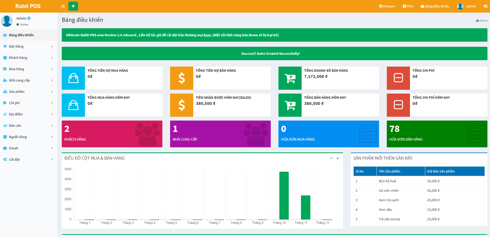
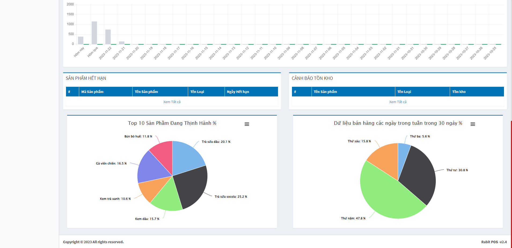
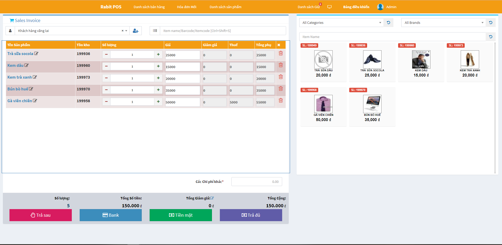
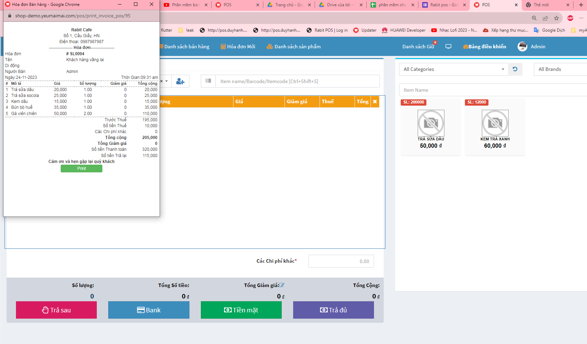

# rabitpos
Tải RabitPos+Xampp về giải nén ra và chạy trên window /xamm/xampp-control.exe
Chọn Admin trong mục apache hoặc vào trình duyệt gõ: localhost rùi ấn enter

Login với tài khoản 
admin:123456
saler:123456

link demo
https://demo.rabitpos.com/

link hướng dẫn cài qua xampp chạy trực tiếp trên máy tính cá nhân
https://www.youtube.com/watch?v=5NQyU1mRMeY

    

Nếu bác nào dùng thấy hiệu quả và phù hợp donate cho tác giả nhé
